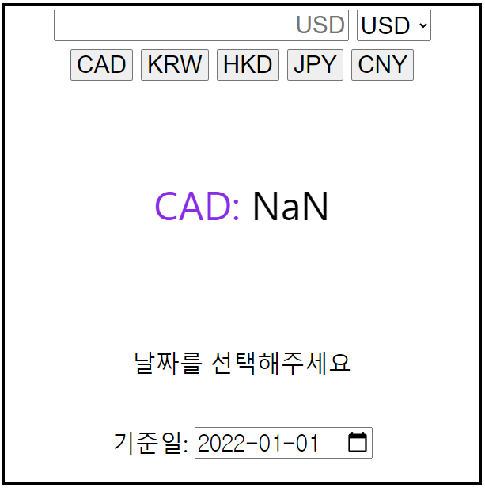
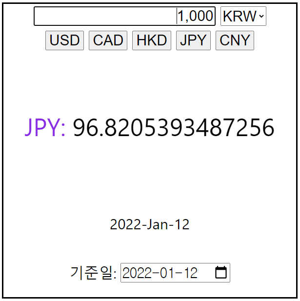

# POB_task_2

- 파일 구성

1. redux

   - slice.js: redux에 사용될 slice 생성
   - store.js: redux에 사용될 store 생성

2. App.js
   환율 계산 페이지 구현

- 전체적인 동작 설명

날짜에 따른 환율 API를 받아와  
선택된 국가에 따른 계산 결과를 출력합니다  
날짜는 선택이 가능합니다

- 초기 실행 화면
  

- 금액 입력, 국가와 날짜 선택 시
  

---

기준일 input에서 onChnage가 되면 값이 변한다
-> 그럼 굳이 값이 변하길 기다렸다가 요청을 보내야할까?

input에 값이 바뀌면 onChange를 먼저 보자!
